# Component Architecture Diagrams

## Component Hierarchy and Data Flow

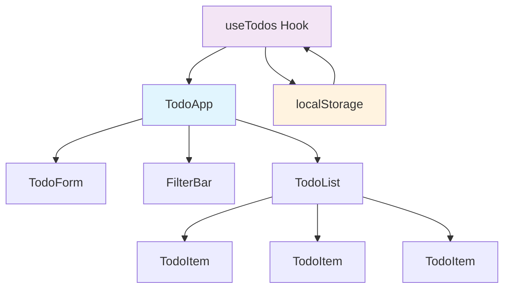

## Data Flow Architecture

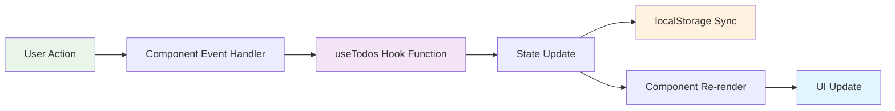

## Component Props and State Flow

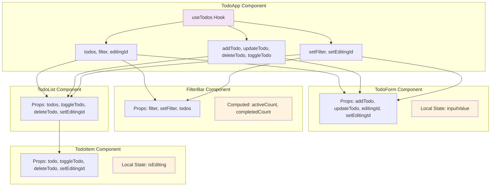

## State Management Flow

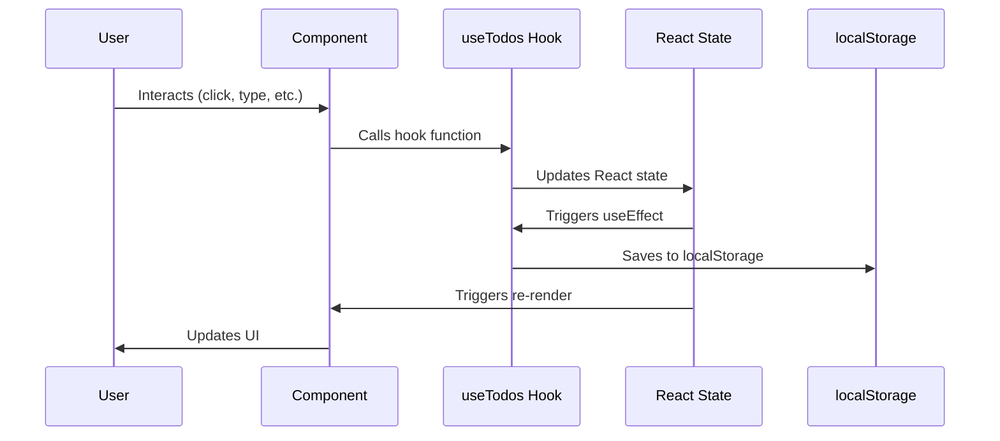

## Component Lifecycle and Persistence

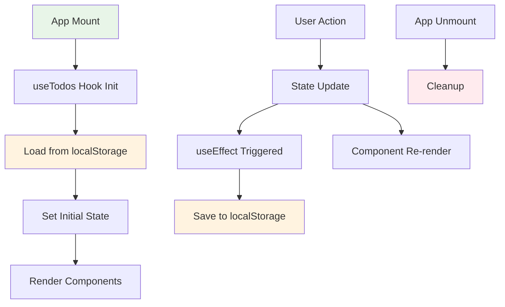

## Filter Logic Flow

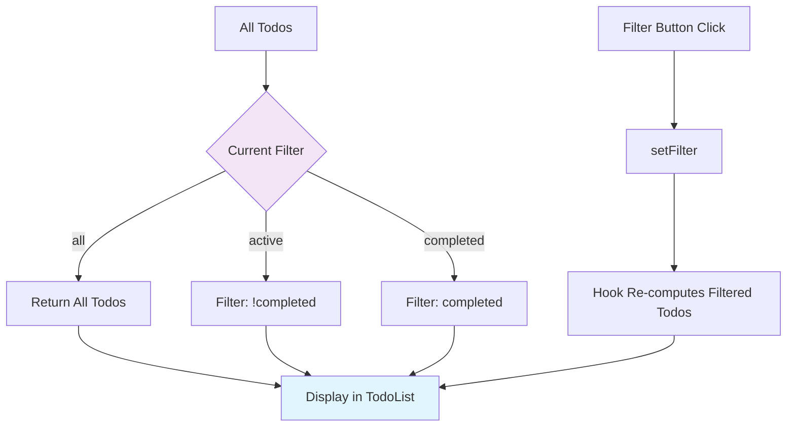

## Animation Trigger Points

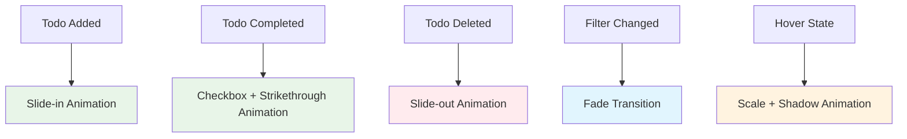

## Accessibility Flow

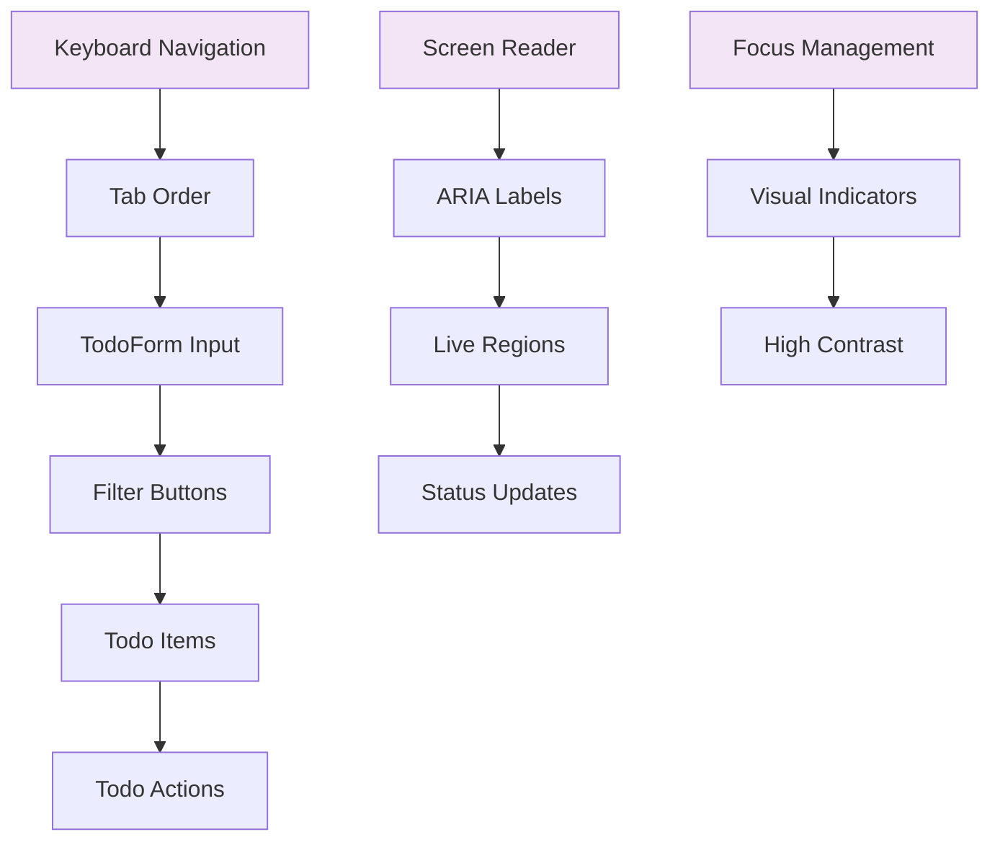

## Error Handling Flow

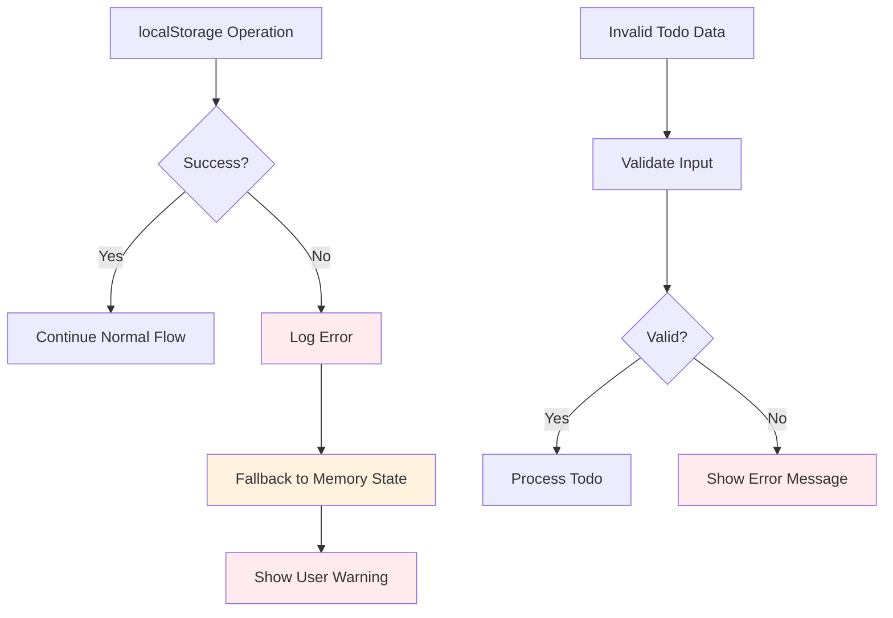

## Performance Considerations

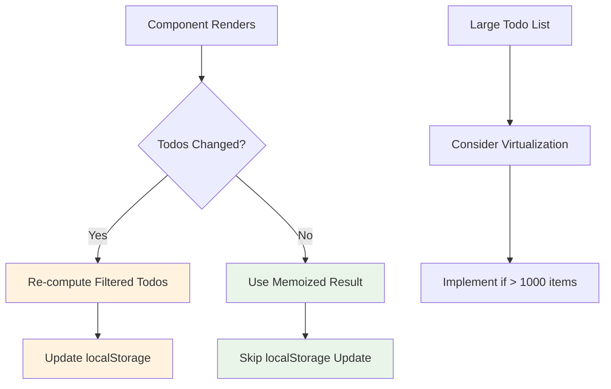

## Component Communication Patterns

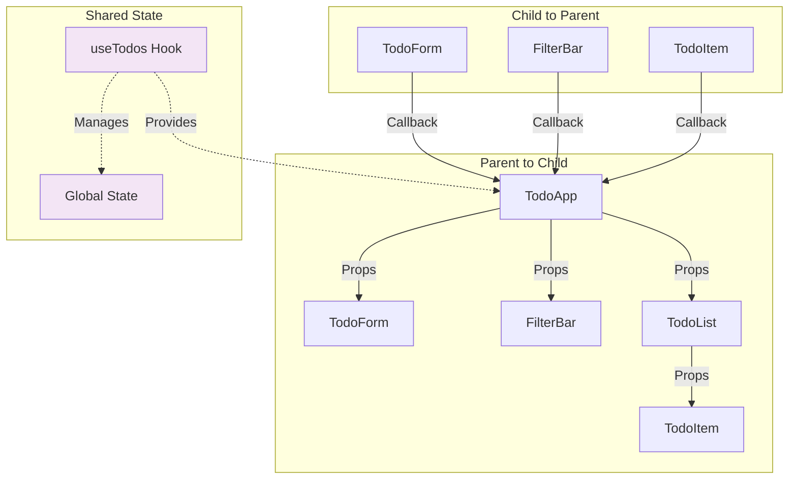

This diagram collection provides a comprehensive visual guide to understanding the component architecture, data flow, and interaction patterns in the todo application.